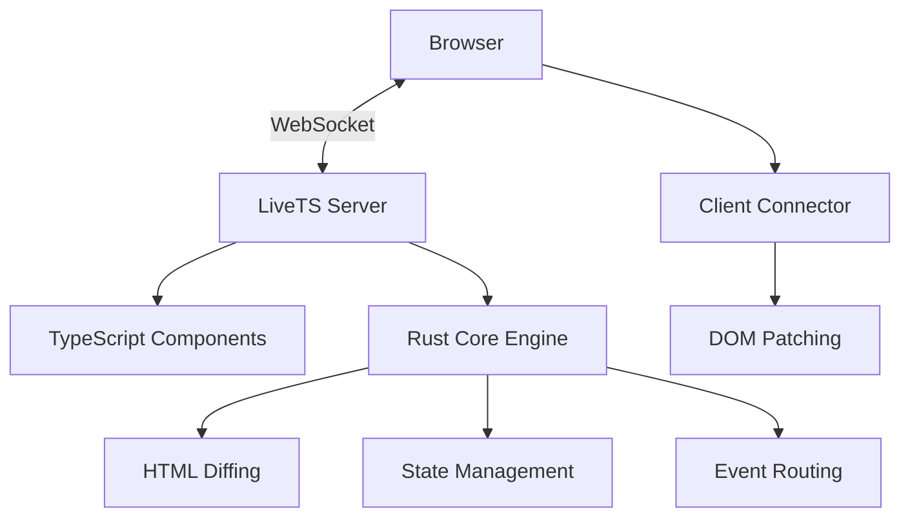

# LiveTS

> Real-time server-rendered web applications with TypeScript and Rust

LiveTS is a modern framework for building real-time, server-rendered web applications. Inspired by Phoenix LiveView and Blazor Server, it combines the productivity of TypeScript with the performance of Rust.

[](https://github.com/magnusbag/livets/actions/workflows/ci.yml)
[](https://img.shields.io/npm/v/@magnusbag/livets-core)

## Features

- 🚀 **Real-time updates** - Live DOM updates over WebSockets
- ⚡ **High performance** - Rust-powered HTML diffing and patching
- 🎯 **TypeScript-first** - Full type safety and excellent DX
- 🔄 **Intelligent diffing** - Minimal DOM updates with smart class change detection
- 🌐 **Server-rendered** - SEO-friendly with progressive enhancement
- 📦 **Lightweight client** - Minimal JavaScript footprint
- 🎨 **Framework agnostic** - Works with any CSS framework (Tailwind, Bootstrap, etc.)

## Quick Start

### Installation

```bash
npm install @livets/core @livets/client @livets/rust-core
```

### Basic Counter Example

```typescript
// counter-component.ts
import { LiveView } from '@livets/core';

interface CounterState {
  count: number;
  step: number;
}

export class CounterComponent extends LiveView<CounterState> {
  getInitialState(): CounterState {
    return { count: 0, step: 1 };
  }

  render() {
    const { count, step } = this.state;
    return `
      <div class="counter">
        <h1>Count: ${count}</h1>
        <button ts-on:click="increment">+${step}</button>
        <button ts-on:click="decrement">-${step}</button>
        <input type="range" min="1" max="10" value="${step}" ts-on:input="setStep" />
      </div>
    `;
  }

  increment() {
    this.setState({ count: this.state.count + this.state.step });
  }

  decrement() {
    this.setState({ count: this.state.count - this.state.step });
  }

  setStep(payload: any) {
    const step = parseInt(payload.target.value, 10);
    this.setState({ step });
  }
}
```

```typescript
// server.ts
import { LiveTSServer } from '@livets/core';
import { CounterComponent } from './counter-component';

const server = new LiveTSServer({
  port: 3000,
  staticDir: './public'
});

server.registerComponent('counter', CounterComponent);

server.get('/', c => {
  const counterHtml = server.renderComponent('counter');
  return c.html(`
    <!DOCTYPE html>
    <html>
    <head>
      <title>LiveTS Counter</title>
      <script src="/livets-client.js"></script>
    </head>
    <body>
      <div id="app">${counterHtml}</div>
      <script>new LiveTSConnector().connect();</script>
    </body>
    </html>
  `);
});

server.start();
```

## Architecture

LiveTS uses a hybrid architecture combining the best of both worlds:

- **TypeScript Layer** (`@livets/core`) - Component definitions, state management, routing
- **Rust Core** (`@livets/rust-core`) - High-performance HTML diffing, WebSocket handling, state storage
- **Client Connector** (`@livets/client`) - Lightweight browser client for DOM patching



## Key Concepts

### Components

LiveTS components are TypeScript classes that extend `LiveView`:

```typescript
export class MyComponent extends LiveView<MyState> {
  getInitialState(): MyState {
    /* ... */
  }
  render(): string {
    /* ... */
  }

  // Event handlers
  handleClick() {
    /* ... */
  }
  handleInput(payload: any) {
    /* ... */
  }
}
```

### State Management

- Components manage their own state with `setState()`
- State changes trigger automatic re-renders
- Only changed DOM elements are updated

### Event Handling

Use `ts-on:` attributes to bind events:

```html
<button ts-on:click="handleClick">Click me</button>
<input ts-on:input="handleInput" />
<form ts-on:submit="handleSubmit">...</form>
```

### Real-time Updates

Components can subscribe to channels for real-time updates:

```typescript
export class ChatComponent extends LiveView<ChatState> {
  mount() {
    this.subscribe('chat-updates');
  }

  updated() {
    // Handle external updates
  }
}
```

## Performance

LiveTS is designed for performance:

- **Intelligent diffing**: Only updates changed DOM elements
- **Minimal payloads**: Sends targeted patches, not full HTML
- **Rust-powered**: Core diffing algorithm written in Rust
- **Class change detection**: Efficiently handles CSS class updates
- **WebSocket optimization**: Persistent connections with minimal overhead

## Examples

Check out the `examples/` directory for complete working examples:

- **Counter** - Basic state management and events
- **Chat** (coming soon) - Real-time messaging
- **Dashboard** (coming soon) - Complex UI with live data

## Development

### Prerequisites

- Node.js 18+
- Rust 1.70+
- npm or yarn

### Building from source

```bash
git clone https://github.com/your-username/livets.git
cd livets
npm install
npm run build
```

### Running tests

```bash
npm test
```

### Running examples

```bash
npm run dev
# Opens http://localhost:3000
```

## Contributing

We welcome contributions! Please see [CONTRIBUTING.md](CONTRIBUTING.md) for guidelines.

## License

MIT License - see [LICENSE](LICENSE) for details.

## Inspiration

LiveTS is inspired by:

- [Phoenix LiveView](https://hexdocs.pm/phoenix_live_view/) - Elixir/Phoenix
- [Blazor Server](https://docs.microsoft.com/en-us/aspnet/core/blazor/) - .NET
- [Hotwire](https://hotwired.dev/) - Ruby on Rails
