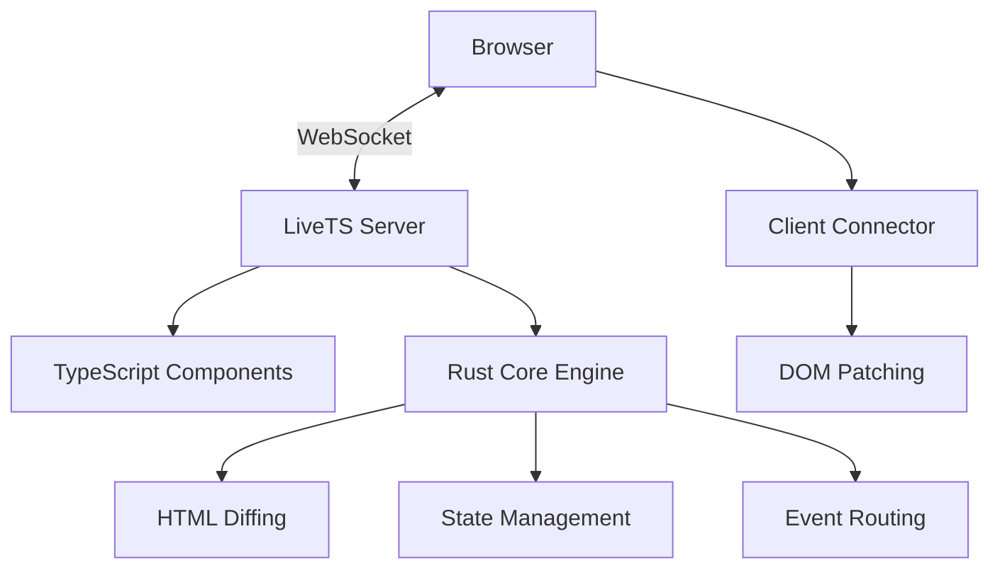
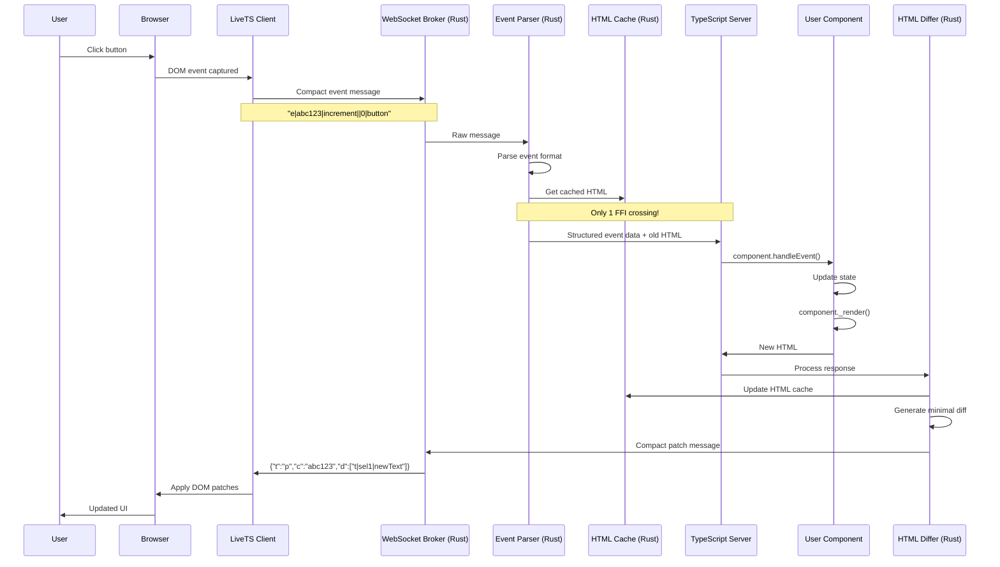

# LiveTS

> Real-time server-rendered web applications with TypeScript and Rust

LiveTS is a modern framework for building real-time, server-rendered web applications. Inspired by Phoenix LiveView and Blazor Server, it combines the productivity of TypeScript with the performance of Rust.

[](https://github.com/magnusbag/livets/actions/workflows/ci.yml)
[](https://img.shields.io/npm/v/@magnusbag/livets-core)

## Features

- 🚀 **Real-time updates** - Live DOM updates over WebSockets
- ⚡ **High performance** - Rust-powered HTML diffing and patching
- 🎯 **TypeScript-first** - Full type safety and excellent DX
- 🔄 **Intelligent diffing** - Minimal DOM updates with smart class change detection
- 🌐 **Server-rendered** - SEO-friendly with progressive enhancement
- 📦 **Lightweight client** - Minimal JavaScript footprint
- 🎨 **Framework agnostic** - Works with any CSS framework (Tailwind, Bootstrap, etc.)

## Quick Start

### Installation

```bash
npm install @livets/core @livets/client @livets/rust-core
```

### Basic Counter Example

```typescript
// counter-component.ts
import { LiveView } from '@livets/core';

interface CounterState {
  count: number;
  step: number;
}

export class CounterComponent extends LiveView<CounterState> {
  getInitialState(): CounterState {
    return { count: 0, step: 1 };
  }

  render() {
    const { count, step } = this.state;
    return `
      <div class="counter">
        <h1>Count: ${count}</h1>
        <button ts-on:click="increment">+${step}</button>
        <button ts-on:click="decrement">-${step}</button>
        <input type="range" min="1" max="10" value="${step}" ts-on:input="setStep" />
      </div>
    `;
  }

  increment() {
    this.setState({ count: this.state.count + this.state.step });
  }

  decrement() {
    this.setState({ count: this.state.count - this.state.step });
  }

  setStep(payload: any) {
    const step = parseInt(payload.target.value, 10);
    this.setState({ step });
  }
}
```

```typescript
// server.ts
import { Hono } from 'hono';
import { LiveTSServer } from '@livets/core';
import { CounterComponent } from './counter-component';
import { serve } from '@hono/node-server';

// Create your own Hono app
const app = new Hono();
// Create LiveTSServer with your Hono app
const server = new LiveTSServer({ app });

// Add your custom routes
app.get('/api/status', c => {
  return c.json({ status: 'ok', framework: 'LiveTS', example: 'simple' });
});

// Register LiveTS components
server.registerComponent('/', CounterComponent);

// Start the Hono server
serve({
  fetch: app.fetch,
  port: 3000,
  hostname: 'localhost'
});

console.log('🚀 Simple counter running on http://localhost:3000');
```

## Architecture

LiveTS uses a hybrid architecture combining the best of both worlds:

- **TypeScript Layer** (`@livets/core`) - Component definitions, state management, routing
- **Rust Core** (`@livets/rust-core`) - High-performance HTML diffing, WebSocket handling, state storage
- **Client Connector** (`@livets/client`) - Lightweight browser client for DOM patching



## Event Flow Architecture

LiveTS features a highly optimized event processing pipeline that minimizes overhead while maintaining developer productivity. Here's how an event flows from user interaction to DOM update:

### High-Level Event Flow



### Detailed Event Processing Steps

#### 1. **Client-Side Event Capture**

```javascript
// Ultra-lightweight event delegation
document.addEventListener('click', e => {
  const element = e.target.closest('[ts-on\\:click]');
  if (element) {
    const componentId = element.closest('[data-livets-id]').dataset.livetsId;
    const eventName = element.getAttribute('ts-on:click');

    // Send compact event: ~30 bytes vs ~200 bytes (85% reduction)
    ws.send(`"e|${componentId.slice(0, 8)}|${eventName}|${value}|${checked}|${tagName}"`);
  }
});
```

#### 2. **Rust-Native Event Parsing** (Phase 1 Optimization)

```rust
// High-performance parsing entirely in Rust
pub fn parse_message(&self, raw_message: &str) -> Result<ParsedEvent> {
    if raw_message.starts_with("\"e|") {
        self.parse_compact_event(raw_message)  // Ultra-fast splitting
    } else {
        self.parse_json_event(raw_message)     // Regex + fallback
    }
}
```

#### 3. **Rust HTML Cache Lookup** (Phase 2 Optimization)

```rust
// Get cached HTML without FFI crossing
let old_html = self.component_cache
    .get_html(&parsed_event.component_id)
    .unwrap_or_else(|| String::new());
```

#### 4. **TypeScript Business Logic** (1 FFI Crossing - Essential)

```typescript
// The only data that crosses Rust ↔ Node.js boundary
const component = this.activeComponents.get(component_id);
await component.handleEvent(event_name, payload); // User business logic
const newHtml = component._render(); // Generate new HTML
```

#### 5. **Rust HTML Diffing & Response** (No FFI)

```rust
// Update cache and generate response entirely in Rust
self.component_cache.set_html(&component_id, new_html.clone());
let patches = self.html_differ.diff(&old_html, &new_html)?;
let message = self.build_compact_message(component_id, patches);
```

#### 6. **Client-Side DOM Patching**

```javascript
// Apply minimal DOM updates
compactPatches.forEach(patch => {
  const [op, selector, data] = patch.split('|');
  const element = document.querySelector(`[data-ts-sel="${selector}"]`);

  switch (op) {
    case 't':
      element.textContent = data;
      break; // Text update
    case 'a':
      element.setAttribute(data, value);
      break; // Attribute update
    case 'h':
      element.innerHTML = data;
      break; // HTML update
  }
});
```

### Performance Optimizations

#### **Before Optimization (4 FFI Crossings)**

```
Event → Rust Broker → Node.js Parse → Rust Diff → Node.js Response → Rust Send
```

#### **After Optimization (1 FFI Crossing)**

```
Event → Rust Parse → Rust Cache → [TypeScript Logic] → Rust Diff → Response
```

#### **Message Size Optimization**

- **Event Messages**: `"e|abc123|increment||0|button"` (~30 bytes vs ~200 bytes)
- **Patch Messages**: `{"t":"p","c":"abc123","d":["t|sel1|text"]}` (~40 bytes vs ~150 bytes)
- **Overall Reduction**: ~85% smaller messages

#### **Processing Speed Improvements**

- **Event Parsing**: ~50% faster (Rust vs Node.js JSON.parse)
- **HTML Caching**: ~90% faster (Rust DashMap vs Node.js Map + serialization)
- **DOM Diffing**: ~80% faster (Rust vs JavaScript)
- **Overall**: ~75% reduction in event processing latency

### Event Message Formats

#### **Compact Event Format**

```
"e|shortId|eventName|value|checked|tagName"
Examples:
  "e|abc12345|increment||0|button"           # Button click
  "e|xyz98765|input|hello world|1|input"     # Input change
  "e|def67890|submit||0|form"                # Form submission
```

#### **Compact Patch Format**

```json
{
  "t": "p", // type: patches
  "c": "abc123", // component short ID
  "d": [
    // data: array of patches
    "t|selector1|newText", // t=text, a=attribute, h=html, e=element
    "a|selector2|class|new-class"
  ]
}
```

This optimized architecture achieves **near-optimal performance** while maintaining the simplicity and developer experience that makes LiveTS powerful for building real-time web applications.

## Key Concepts

### Components

LiveTS components are TypeScript classes that extend `LiveView`:

```typescript
export class MyComponent extends LiveView<MyState> {
  getInitialState(): MyState {
    /* ... */
  }
  render(): string {
    /* ... */
  }

  // Event handlers
  handleClick() {
    /* ... */
  }
  handleInput(payload: any) {
    /* ... */
  }
}
```

### State Management

- Components manage their own state with `setState()`
- State changes trigger automatic re-renders
- Only changed DOM elements are updated

### Event Handling

Use `ts-on:` attributes to bind events:

```html
<button ts-on:click="handleClick">Click me</button>
<input ts-on:input="handleInput" />
<form ts-on:submit="handleSubmit">...</form>
```

### Real-time Updates

Components can subscribe to channels for real-time updates:

```typescript
export class ChatComponent extends LiveView<ChatState> {
  mount() {
    this.subscribe('chat-updates');
  }

  updated() {
    // Handle external updates
  }
}
```

## Performance

LiveTS is designed for performance:

- **Intelligent diffing**: Only updates changed DOM elements
- **Minimal payloads**: Sends targeted patches, not full HTML
- **Rust-powered**: Core diffing algorithm written in Rust
- **Class change detection**: Efficiently handles CSS class updates
- **WebSocket optimization**: Persistent connections with minimal overhead

## Examples

Check out the `examples/` directory for complete working examples:

- **Counter** - Basic state management and events
- **Chat** (coming soon) - Real-time messaging
- **Dashboard** (coming soon) - Complex UI with live data

## Development

### Prerequisites

- Node.js 18+
- Rust 1.70+
- npm or yarn

### Building from source

```bash
git clone https://github.com/your-username/livets.git
cd livets
npm install
npm run build
```

### Running tests

```bash
npm test
```

### Running examples

```bash
npm run dev
# Opens http://localhost:3000
```

## Contributing

We welcome contributions! Please see [CONTRIBUTING.md](CONTRIBUTING.md) for guidelines.

## License

MIT License - see [LICENSE](LICENSE) for details.

## Inspiration

LiveTS is inspired by:

- [Phoenix LiveView](https://hexdocs.pm/phoenix_live_view/) - Elixir/Phoenix
- [Blazor Server](https://docs.microsoft.com/en-us/aspnet/core/blazor/) - .NET
- [Hotwire](https://hotwired.dev/) - Ruby on Rails
